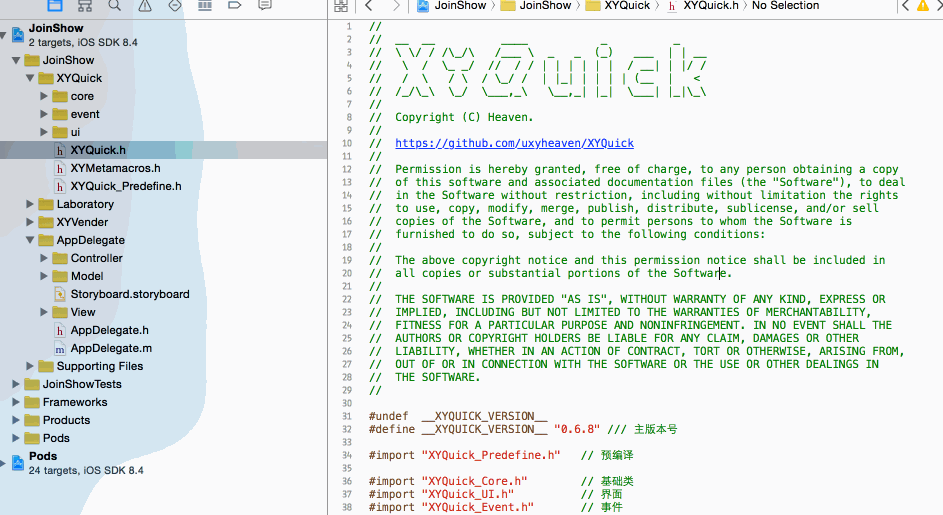

# iOS Xcode制作模板类
转载请注明出处<https://github.com/uxyheaven/XYXcodeTemplate/tree/master>

## 为什么要定义模板类
代码规范提高代码可读性, 降低后期维护成本. 当我们定下了一个团队都认同的代码规范, 如我们要求所有的viewController的代码都得按照下面来组织

```
#pragma mark - def
#pragma mark - override
#pragma mark - api
#pragma mark - model event 
#pragma mark - view event
#pragma mark - private
#pragma mark - getter / setter
```
可落地的时候, 你懂的....

如何要求崇尚自由的developer都按照这个去写,尤其是还得先记下这个规范.
静态检查是一个办法. Review的时候强制要求改是一种办法. 本文将介绍另外一种办法, 建立模板类.

## 如何用定义好的模板类
如何用定义好的模板类, 直接看一段动画:

在建立类模板文件的时候, 把我们定义好的代码组织规范都搬进去. 这样大伙写代码就不会太随意了吧? 

## 模板类如何制作
从头制作一个模板类有些坑. 我们采用简单的办法, 先拷贝一个模板类, 然后修改成自己需要的样子. 
<https://github.com/uxyheaven/XYXcodeTemplate/blob/master/xcode_template.zip>这里笔者建立的一个简单的模板类的模板. 先下载下来, 再修改成你需要的样子, 最后拷贝到Xcode(写这篇文章的时候是Xcode6哦,如果今后目录变了,自行找下)的文件模板文件夹里 `/Applications/Xcode.app/Contents/Developer/Library/Xcode/Templates/File Templates/Folder`. 这样就可以使用了.

### 修改说明
从系统类继承的直接在系统类的文件夹里改

* 如从UIViewController继承的, 在ViewController里直接改

从自定义类继承的, 需要做做一些设置

* `___FILEBASENAME___.h` 里导入的头文件改一下, 基类改一下
* `___FILEBASENAME___.m` 里改成你希望的
* 文件夹的名字改成基类的名字
* TemplateInfo.plist里的Options -> Item 1 -> Values -> Item 1 的值改成基类的名字
